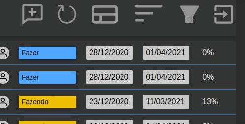
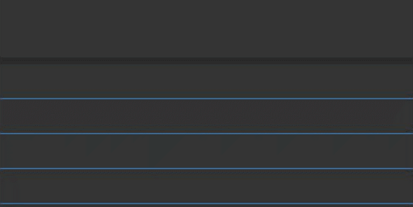

<h1 align="center"> <strong>GTPP - Gerenciador de Tarefas<h1></strong>

<h3>Desenvolvido por:</h3>

><strong>FrontEnd</strong> Felipe

><strong>BackEnd</strong><a href="https://github.com/kyotsuyoi"> Kyo</href>

<h3>Ideia Geral</h3>

Aplicação para gerenciar e designar tarefas, funcionalidades aplicadas em tempo real (webSocket).

<h3>Algumas funcionalidades do APP</h3>

<h2># LOGIN</h2>

O login pede usuário e senha

- Caso seja o primeiro acesso do usuário, a senha padrão é 1234

- Para acessar a página principal é solicitado que altere a senha padrão

<h2># CRIAR TAREFA</h2>

- Preenchimento obrigatório de todos os campos para criar a tarefa

- Após a confirmação, a tarefa é adicionada na lista, de forma destacada

<h2># PESQUISAR TAREFA</h2>

Opção de pesquisar a tarefa por descrição ou por funcionário (dono da tarefa)

<h2># INFO USUÁRIO</h2>

- Informações sobre o usuário que efetuou o login

- Alterar a senha pelo app (qualquer usuário)

- Visualizar ranking de pontuação (qualquer usuário)

- Visualizar todas as tarefas (administrador)

<h2># FILTRAR LISTA DE TAREFAS</h2>

- Filtrar por estado

- Filtrar por companhia, loja e departamento

<h2># ITENS NA LINHA</h2>

- O usuário pode ocultar alguns itens da linha da tarefa.

<h2># ORDENAR LISTA DE TAREFAS</h2>

- O usuário pode ordenar a lista por:

<ul>
<li>Prioridade</li>
<li>Estado</li>
<li>Descrição</li>
<li>Vencimento</li>
</ul>

<h2># ATUALIZAR LISTA DE TAREFAS</h2>

- Busca novamente as informações do banco

<h2># LAYOUT MODAL DA TAREFA</h2>

<h2># ALTERAR PRIORIDADE DA TAREFA</h2>

- O usuário pode alterar a prioridade da tarefa

- Somente se a tarefa não estiver nos respectivos estados

<ul>
    <li>Feito</li>
     <li>Cancelado</li>
      <li>Bloqueado</li>
       <li>Parado</li>
</ul>

<h2># ALTERAR SENHA DE USUÁRIO</h2>

- O usuário pode alterar a senha diretamente pelo app

<h2># ESTADOS DA TAREFA</h2>

Existem 7 estados em que a tarefa pode estar, sendo um deles automático como bloqueio se a tarefa passar do prazo definido

<ul>
    <li>Estados:</li>
    <li>Fazer</li>
    <li>Fazendo</li>
    <li>Análise</li>
    <li>Parado</li>
    <li>Bloqueado</li>
    <li>Feito</li>
    <li>Cancelado</li>
</ul>

<h2># USUÁRIOS VINCULADOS</h2>

- Visualização de usuários

<h2># INFORMAÇÕES USUÁRIOS VINCULADOS - MODAL</h2>

<h2># ANEXAR ARQUIVOS NOS TÓPICOS</h2>

- O usuário pode anexar arquivos do tipo: zip, png, jpg, gif, docx, xlsb

<h2># DEFINIR TÓPICO</h2>

- O usuário pode definir tópico com uma questão

- O usuário pode adicionar uma observação ao tópico

<h2># NOTIFICAÇÃO EM TEMPO REAL</h2>

- A aplicação notifica os usuários de mudanças que ocorrem em tarefas a qual o mesmo está vinculado

<h2># HISTÓRICO DE NOTIFICAÇÕES</h2>

- A aplicação armazena notificações

- Caso o usuário esteja offline elas são armazenadas no banco de dados, assim que o usário efetuar o login elas serão armazenadas no histórico e apagadas do banco

<h2># MUDANÇAS NA APLICAÇÃO EM TEMPO REAL</h2>

- Todas as mudanças na aplicação por interação dos usuários são efetuadas em tempo real

- No exemplo, o usuário foi vinculado a uma nova tarefa

<h2># RANKING DE USUÁRIOS</h2>

- Conforme os usuários avançam em suas tarefas podem marcar ou perder pontos

<h2># DESCONEXÃO AUTOMÁTICA</h2>

- Se a mesma conta for aberta em outro local, ocorre uma desconexão automática

- Somente pode existir um socket conectado por conta

<h2># HISTÓRICO DE MUDANÇAS NO ESTADO DA TAREFA</h2>

<h2># WEBCHAT</h2>

- Existe um chat disponível para cada tarefa

<h2># ANEXAR NO CHAT</h2>

- O usuário pode anexar imagens no chat

<h2># AVISOS NA TAREFA</h2>

- Existem 3 tipos de avisos dependendo da data final da tarefa

<ul>
<li>X dias para expirar</li>
<li>X dias para começar</li>
<li>X dias que está vencida</li>
</ul>

